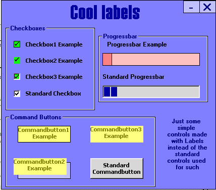



## CoolLabels

### Description

Simple way to have labels replace a couple of standard controls. Very easy to do!
 
### More Info
 

             |
---                |---
**Submitted On**   |2001-10-22 03:45:10
**By**             |[John W](https://github.com/Planet-Source-Code/PSCIndex/blob/master/ByAuthor/john-w.md)
**Level**          |Beginner
**User Rating**    |5.0 (25 globes from 5 users)
**Compatibility**  |VB 6\.0
**Category**       |[Custom Controls/ Forms/  Menus](https://github.com/Planet-Source-Code/PSCIndex/blob/master/ByCategory/custom-controls-forms-menus__1-4.md)
**World**          |[Visual Basic](https://github.com/Planet-Source-Code/PSCIndex/blob/master/ByWorld/visual-basic.md)
**Archive File**   |[CoolLabels3034310222001\.zip](https://github.com/Planet-Source-Code/john-w-coollabels__1-28321/archive/master.zip)

